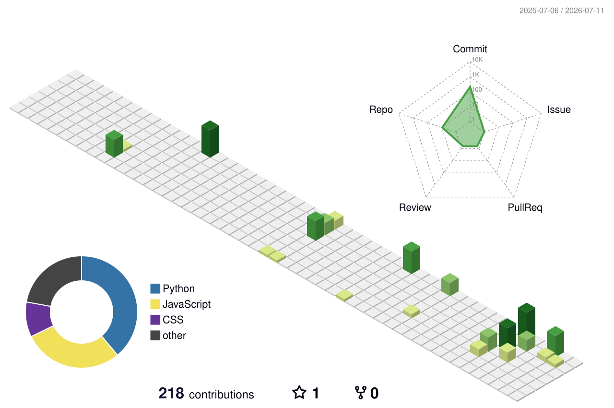

# Hi there, I'm Panth Haveliwala! 👋 

  

  
  
  

  

---

### 💫 About Me

I am a highly motivated B.Tech student in **Computer Engineering** at **SVKM's NMIMS (Mukesh Patel School of Technology Management & Engineering)**, Shirpur Campus. I specialize in building AI/ML applications, full-stack systems, and cybersecurity solutions. I frequently lead technical teams in hackathons, turning complex problems into functional, high-performance software.

- 🎓 **Education:** Pursuing B.Tech in Computer Engineering at SVKM's NMIMS (2024 - 2028).
- 📍 **Location:** Valsad, Gujarat, India.
- 🔭 **Current Focus:** Developing real-time computer vision models, optimizing edge AI systems, and building scalable full-stack web applications.
- 🌱 **Learning:** Cloud architecture patterns, advanced system design, and large language model integration.
- ⚙️ **Approach:** Modular clean code, security-first development, and agile prototyping.
- 📫 **Contact:** [panthhaveliwala@gmail.com](mailto:panthhaveliwala@gmail.com) | [LinkedIn Profile](https://www.linkedin.com/in/panth-haveliwala-06811131a)

---

### 🛠️ Tech Stack & Tools

  <!-- Languages -->
  
  
  
  
  
  
  
  

  <!-- Frameworks & Libraries -->
  
  
  
  
  
  
  
  

  <!-- Database & Tools -->
  
  
  
  
  

---

### 🚀 Featured Projects

#### 🛡️ GuardianAI: Real-Time Fall Detection System (Jan 2026)
*An intelligent AI safety system designed to monitor and detect falls in real-time to protect elderly and vulnerable individuals.*
- 💡 **Problem Solved:** Immediate detection and rapid alert routing for fall events to minimize medical response times.
- 🛠️ **Technical Implementation:** Built a lightweight neural network deployed with **TensorFlow Lite** on the backend. Integrates a **Flask** backend api with a responsive **React** dashboard, using **Firebase Cloud Messaging (FCM)** for instantaneous push notifications.
- 📦 **Tech Stack:** `Python` | `React` | `Flask` | `TensorFlow Lite` | `Firebase FCM`

#### 🛡️ Cloud Login Anomaly Detection (Sep 2025)
*An AI-driven cybersecurity system designed to identify suspicious login attempts and prevent unauthorized access in cloud environments.*
- 💡 **Problem Solved:** Detecting account takeovers and automated dictionary attacks by analyzing access logs.
- 🛠️ **Technical Implementation:** Utilized **Scikit-learn** to build classification models that analyze geolocation profiles, IP reputations, and login timestamps. Implemented geofencing rules and "impossible travel" algorithms to dynamically score session risk.
- 🏆 *Developed as a project for the DA-IICT Hackathon.*
- 📦 **Tech Stack:** `Python` | `Scikit-learn` | `Pandas` | `AI Classifier Models`

#### 📍 LOC-TRACER: Location Tracking Dashboard (Oct 2025)
*An interactive GPS mapping and track analysis dashboard for spatial record processing.*
- 💡 **Problem Solved:** Visualizing multi-point coordinate logs over time in a clean, user-friendly interface.
- 🛠️ **Technical Implementation:** Designed a **Streamlit** user interface to upload log sheets. Handled coordinate cleaning and indexing with **Pandas**, mapping coordinates onto interactive visual layers using **Folium**.
- 📦 **Tech Stack:** `Python` | `Streamlit` | `Folium` | `Pandas`

#### 🎬 Movie Recommendation System (Mar 2025)
*A content-based filtering system matching user profiles with movies from large databases.*
- 💡 **Problem Solved:** Solving the cold start problem and supplying highly relevant matching based on movie descriptions.
- 🛠️ **Technical Implementation:** Utilized **TF-IDF Vectorization** and **Cosine Similarity** algorithms to find semantic similarities between movie tags. Wrapped the system in an interactive **Streamlit** web app.
- 📦 **Tech Stack:** `Python` | `Streamlit` | `Scikit-learn` | `TF-IDF`

---

### 🏆 Academic Achievements & Certifications

- 🥇 **Batch Topper:** Ranked **First** in the SVKM's NMIMS Shirpur Campus B.Tech CE batch (2024-2028) in the 3rd semester with a **9.41 GPA** (Overall CGPA: **8.54/10**).
- 🏆 **Hackathon Leader:** Led teams of 2–5 members in multiple college-level and inter-college hackathons, securing a **Top 3 finish** in the Inter-College Hackathon (2024-2025).
- 📜 **NPTEL Certification:** Successfully completed and certified in *Data Structures and Algorithms* (Nov 2025).
- 🎯 **HackerRank Milestones:** Achieved **5-Star Badges** in both Python and C++ languages.

  
  

---

### 📊 GitHub Activity & Statistics

  

  

  
  
  

#### 📈 Contribution Activity Graph

  

#### 🧊 3D Contribution Calendar

  <picture>
    <source media="(prefers-color-scheme: dark)" srcset="profile-3d-contrib/profile-night-rainbow.svg">
    <source media="(prefers-color-scheme: light)" srcset="profile-3d-contrib/profile-green-animate.svg">
    
  </picture>

#### 🎮 Contribution Snake Game

  <picture>
    <source media="(prefers-color-scheme: dark)" srcset="https://raw.githubusercontent.com/PANTH217/PANTH217/output/github-contribution-grid-snake-dark.svg">
    <source media="(prefers-color-scheme: light)" srcset="https://raw.githubusercontent.com/PANTH217/PANTH217/output/github-contribution-grid-snake.svg">
    
  </picture>

---

### ✍️ Random Dev Quote

  

---

  🌱 <i>"The best way to predict the future is to invent it."</i>

<!-- Proudly created with GPRM ( https://gprm.itsvg.in ) -->
